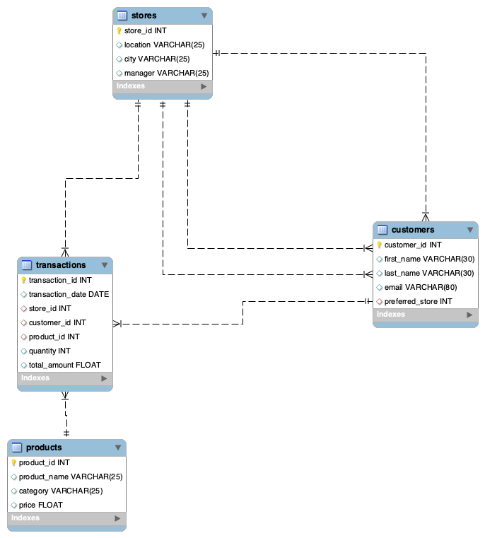

# Coffee Shop Sales Analysis - SQL Project

## Quick Overview
Analyzed sales data for "Brew & Bean" coffee shop chain to find business insights using SQL.

## What's Included
1. **Database Design** (ER Diagram) - Shows 4 related tables
2. **SQL Analysis** - 7 business questions answered
3. **Sample Data** - Realistic transactions

## Database Structure
4 Tables:
- products - Menu items (Coffee & Bakery)
- customers - Customer information  
- stores - Shop locations
- transactions - Sales records

## SQL Queries (7 Analysis Tasks)
All code is in `coffee_shop_analysis.sql`:
1. Revenue by product category
2. Best selling products  
3. Top 5 customers by spending
4. Highest revenue store
5. Yearly sales performance
6. Customers per store in 2024
7. Best selling months

## How to Run
1. Open `coffee_shop_analysis.sql` in MySQL
2. Run the CREATE TABLE statements first
3. Execute each query to see results

## Skills Demonstrated
- SQL queries (JOINs, GROUP BY, aggregations)
- Database design (normalization, foreign keys)
- Business analysis (revenue, customer behavior)

---
*Created by Bello Rihanat Oluwayemisi*